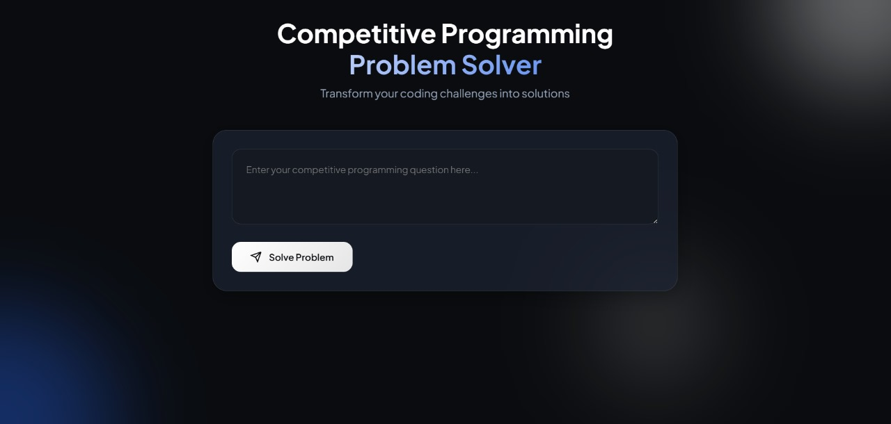

# Competitive Programming Code Generation 🚀

## Overview
This project introduces a robust, **multi-agent system with Hybrid RAG** approach designed to analyze and solve competitive programming (CP) problems while generating comprehensive and edge-case test cases. With a curated database of over **300+ competitive programming problems**, the framework captures detailed problem descriptions, constraints, examples, and solution strategies across various complexity levels, including brute force, intermediate, and optimal approaches.

By constructing a **dynamic knowledge graph with FAISS based RAG** (Retrieval-Augmented Generation), the system retrieves and synthesizes problem insights to develop efficient solution pipelines. Through agent collaboration, it automates the problem-solving process from analysis to code generation.

## System Architecture 🧩
### Problem Database
- **Extensive Dataset:** Over 300 CP problems with well-structured information, including solution approaches and executable code.
- **Detailed Insights:** Comprehensive problem-solving steps enhance solution retrieval and validation.

### Hybrid RAG : Knowledge Graph & FAISS 🌐
- **Dynamic Knowledge Graph:** Captures relationships between problem attributes and solution patterns for intelligent retrieval.
- **FAISS-Based Retrieval:** Enables fast and scalable semantic search for relevant problems and strategies.
- **Structured and Faster Reasoning:** Seamlessly integrates structured knowledge from the graph with high-speed semantic retrieval from FAISS, enabling deep reasoning, multi-hop problem-solving, and context-aware solution generation.

### Agent Framework 🤖
- **Analysis Agent:** Breaks down user-provided CP problems, identifying key constraints and objectives.
- **Planning Agent:** Develops structured solution strategies, algorithms, and pseudocode.
- **Coding Agent:** Translates pseudocode into fully executable and optimized code solutions.
- **Test Case Agent:** Automatically generates diverse test cases, including edge cases, for solution validation.
- **Optimizing Agent:** Evaluates and optimizes time and space complexity to produce the most efficient solution.

## Technical Workflow ⚙️
1. **Problem Analysis:** The Analysis Agent dissects the problem statement to extract critical constraints.
2. **Knowledge Retrieval:** Graph-RAG is leveraged to retrieve analogous problem insights.
3. **Solution Planning:** The Planning Agent formulates algorithmic strategies and detailed pseudocode.
4. **Code Generation:** The Coding Agent converts pseudocode into an optimized, executable solution.
5. **Test Case Creation:** The Test Case Agent produces diverse and comprehensive test scenarios.
6. **Complexity Optimization:** The Optimizing Agent evaluates and fine-tunes the code for optimal performance.
7. **Solution Deployment:** Outputs a validated and efficient solution ready for testing.

## Key Features 🔑
- **Scalable Knowledge Integration:** Continuously learns and adapts as new problems are added.
- **Agent Collaboration:** Distributed architecture ensures task specialization and parallel processing.
- **Comprehensive Test Generation:** Robust testing guarantees solution reliability.
- **Knowledge-Driven Problem Solving:** Intelligent retrieval of patterns for algorithm development.
- **Complexity Optimization:** Ensures the most efficient code in terms of time and space.
- **Modular and Extensible:** Supports future integration with other platforms.

## Tech Stack 🛠️
- **Agent Framework:** CrewAI for agent-based architecture
- **Database and Knowledge Graph:** Neo4j
- **Retrieval and Processing:** LangChain, FAISS
- **Frontend and Backend:** FastAPI, HTML, CSS

## Repo Structure

-  `backend/`   
    -  `agents.py` - Implements the **Knowlege Graph and FAISS based RAG approach** with agent definitions.  
    -  `main.py` - Main backend script handling API requests and execution.  

-  `frontend/` 
    -  `index.html` - Main HTML structure for the web interface.  
    -  `script.js` - JavaScript logic for interactivity.  
    -  `styles.css` - Styling for the frontend.  

-  `requirements.txt` - Lists dependencies required for the backend.  

  

## Future Scope 🌟
- **Integrated Compiler:** Build a compiler linked with a debugger cycle to generate the perfect code.
- **Dataset Expansion:** Ongoing enrichment of problem and solution datasets.
- **Enhanced Retrieval Algorithms:** Optimized similarity detection for improved knowledge graph queries.
- **Platform Integration:** Compatibility with external CP environments.
- **Advanced Debugging Features:** Agents for real-time code analysis and performance optimization.

## Mentors & Contributors 👥
- **Mentors:** Param Thakkar, Pranav Janjani, Anish Singh 
- **Contributors:** [Ninad Shegokar](https://github.com/NinadShegokar), [Khush Agrawal](https://github.com/Khushmagrawal), [Sujal Sakpal](https://github.com/sujal-sakpal) and [Rohit Bhargav](https://github.com/Rohitb502)

## Acknowledgements ❤️
* Team Works-On-My-Machine
* Community of Coders (COC) at VJTI, Mumbai. 
